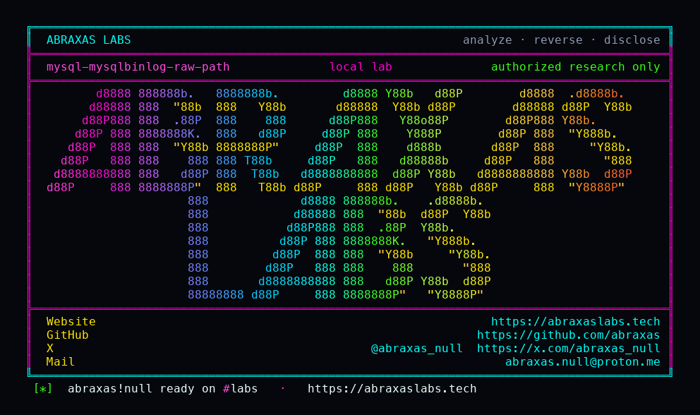

<p align="center">
  
</p>

<p align="center">
  <a href="https://abraxaslabs.tech"><strong>abraxaslabs.tech</strong></a>
  &nbsp;·&nbsp;
  <a href="https://github.com/abraxas">github.com/abraxas</a>
  &nbsp;·&nbsp;
  <a href="https://x.com/abraxas_null">@abraxas_null</a>
  &nbsp;·&nbsp;
  <a href="mailto:abraxas.null@proton.me">abraxas.null@proton.me</a>
  &nbsp;·&nbsp;
  <a href="https://github.com/abraxas/mysql-mysqlbinlog-raw-path">mysql-mysqlbinlog-raw-path</a>
</p>

# mysql-mysqlbinlog-raw-path

**Class:** File write (client)
**Reach:** Remote (UI:R)

**MySQL Community Server** `mysqlbinlog` `26.7.0` (`06a5c1c`) - Oracle

`mysqlbinlog --raw --read-from-remote-server` copies a Rotate event `new_log_ident` into `log_file_name` with no basename check. The next FORMAT_DESCRIPTION event `my_fopen`s that path and writes `BINLOG_MAGIC` plus the event. A hostile dump that sends a real Rotate ident with `/` writes that file as the client UID.

`--raw` is the documented remote binlog *file* copy. The leftover is treating the ident as a path.

| | |
|---|---|
| ID | no CVE yet |
| Class | **File write** (client `--raw` BINLOG_MAGIC) |
| Reach | **Remote** (victim runs `mysqlbinlog --raw -R` against an attacker dump; UI:R) |
| CWE | [CWE-22](https://cwe.mitre.org/data/definitions/22.html) |
| CVSS | **High: 8.1** `CVSS:3.1/AV:N/AC:L/PR:N/UI:R/S:U/C:H/I:H/A:N` |
| Product | [MySQL Community Server](https://github.com/mysql/mysql-server) `mysqlbinlog` |
| Affected | **26.7.0** (`06a5c1c99c377fc41b2eba1ea244e8b220bdc3c8`) |
| Auth | victim runs `mysqlbinlog --raw -R` against an attacker dump |
| License | [GNU Affero GPL v3.0](LICENSE) |
| Lab | `127.0.0.1` only. Witness file with `BINLOG_MAGIC`. File write, not RCE. |

## What an attacker can do

Stand up a MySQL-protocol server. Speak `COM_BINLOG_DUMP`. Send a matching fake Rotate (timestamp 0, ident equals the requested log name) so the dump does not stop. Send a **real** Rotate (timestamp != 0) whose ident is `/abs/path`. Send a FORMAT_DESCRIPTION event.

The operator who ran `mysqlbinlog --raw -R ... mysql-bin.000001` writes `/abs/path` as the client UID. Contents are binlog bytes (`\xfebin` plus the FD event), not an arbitrary payload. Overwrite any path that UID can create.

A real `mysqld` will not emit a Rotate ident with `/`. The leftover is the client.

## How I found it

Same 26.7.0 hunt as [mysqldump SHOW TABLES overflow](https://github.com/abraxas/mysql-mysqldump-show-tables-overflow) and [mysqldump --tab path](https://github.com/abraxas/mysql-mysqldump-tab-path). Default daemon was empty. Client tools still trusted remote names.

```c
if (raw_mode) {
  if (output_file != nullptr) {
    snprintf(log_file_name, sizeof(log_file_name), "%s%s", output_file,
             rev->new_log_ident);
  } else {
    my_stpcpy(log_file_name, rev->new_log_ident);
  }
}
```

Fake Rotate (`when.tv_sec == 0`) whose ident does not match the requested log **stops** the dump. Matching fake Rotate is skipped (`continue`) after the copy. Real Rotate does not stop. Next FD:

```c
if (!(result_file = my_fopen(
          log_file_name, O_WRONLY | MY_FOPEN_BINARY, MYF(MY_WME)))) {
  error("Could not create log file '%s'", log_file_name);
```

LOAD DATA temps stay `SQL_LOAD_MB` under tmpdir. Closed. Ident length is capped `FN_REFLEN-1`. `/` is not stripped.

Wrong turns already recorded: sending a fake Rotate whose ident is the path (dump stops); using `--result-file` (ident becomes a prefix, different leftover); a real `mysqld` as the oracle; checksums left on.

## Lab

```bash
cd lab
./run.sh
```

Image `mysql:26.7.0`. Binary `/usr/libexec/mysqlsh/mysqlbinlog` Ver 26.7.0 (not on PATH in that image). Control stub: fake Rotate `mysql-bin.000001` plus FD writes `work/mysql-bin.000001`. Traversal stub: matching fake Rotate, real Rotate ident `/work/oracle/MYSQL-BINLOG-RAW-WITNESS`, FD writes that path (`BINLOG_MAGIC`). Published `127.0.0.1:18620` / `18621`. Bind it to loopback. File write of binlog bytes, not RCE. No `--result-file`.

```text
control-basename=yes
traversal-outside=yes
SUCCESS mysql-mysqlbinlog-raw-path ... MYSQL-BINLOG-RAW-WITNESS
```

## The fix

Take `basename` of `new_log_ident` before `my_stpcpy` / `snprintf` into `log_file_name`. `--raw` should write under cwd or `--result-file` prefix, not an ident with `/`.

## References

- [github.com/mysql/mysql-server](https://github.com/mysql/mysql-server) tag [mysql-26.7.0](https://github.com/mysql/mysql-server/tree/mysql-26.7.0) (`06a5c1c99c377fc41b2eba1ea244e8b220bdc3c8`)
- [`client/mysqlbinlog.cc`](https://github.com/mysql/mysql-server/blob/mysql-26.7.0/client/mysqlbinlog.cc) `dump_remote_log_entries`
- Sibling packs: [abraxas/mysql-mysqldump-show-tables-overflow](https://github.com/abraxas/mysql-mysqldump-show-tables-overflow) · [abraxas/mysql-mysqldump-tab-path](https://github.com/abraxas/mysql-mysqldump-tab-path)
